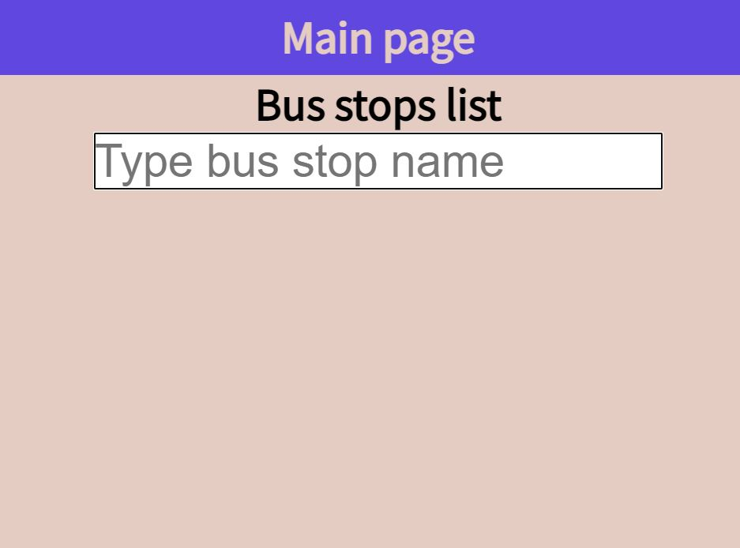
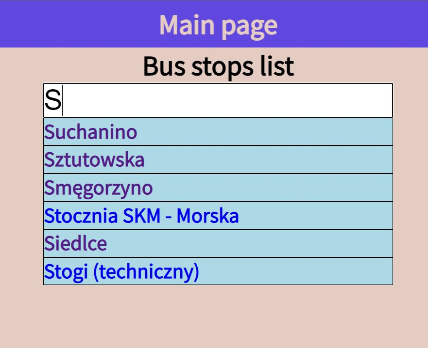
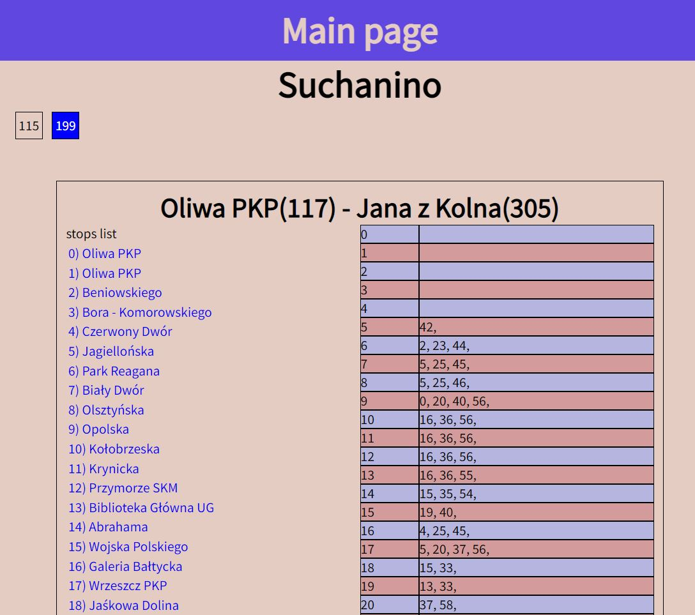
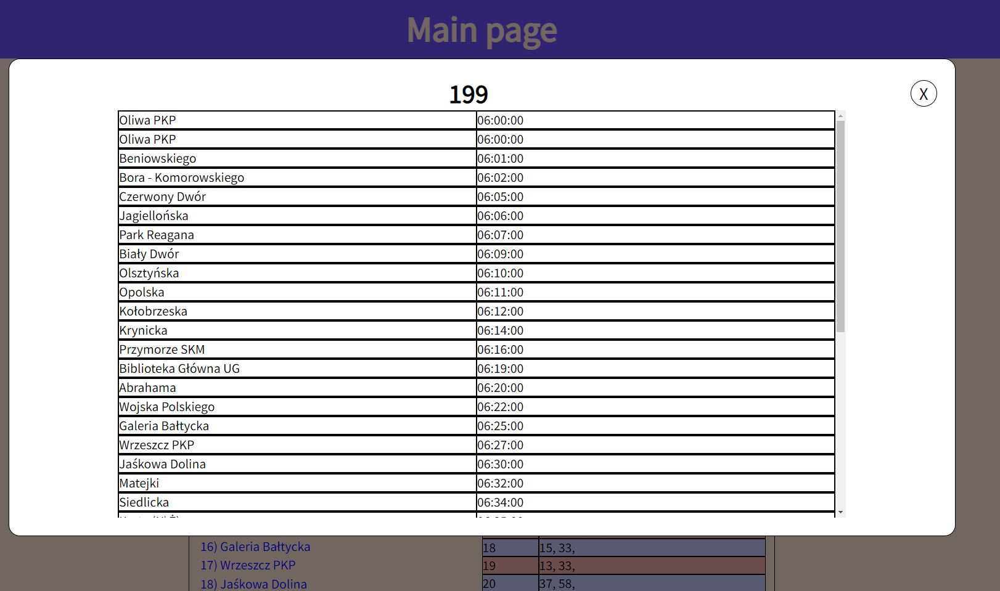

<h1>Bus stops in Trójmiasto</h1>

App created with using React and Redux. 
In this app you can check buses for all bus stops in Gdańsk, Gdynia and Sopot.  
Also you can check when you will arrived selected bus. 

<h2>Data source</h2>
ZTM Gdańsk: <a src="https://ckan.multimediagdansk.pl/dataset/tristar" >https://ckan.multimediagdansk.pl/dataset/tristar</a>

<h2>How to start app</h2>
<code>npm start</code>

<h2>Screenshots</h2>

